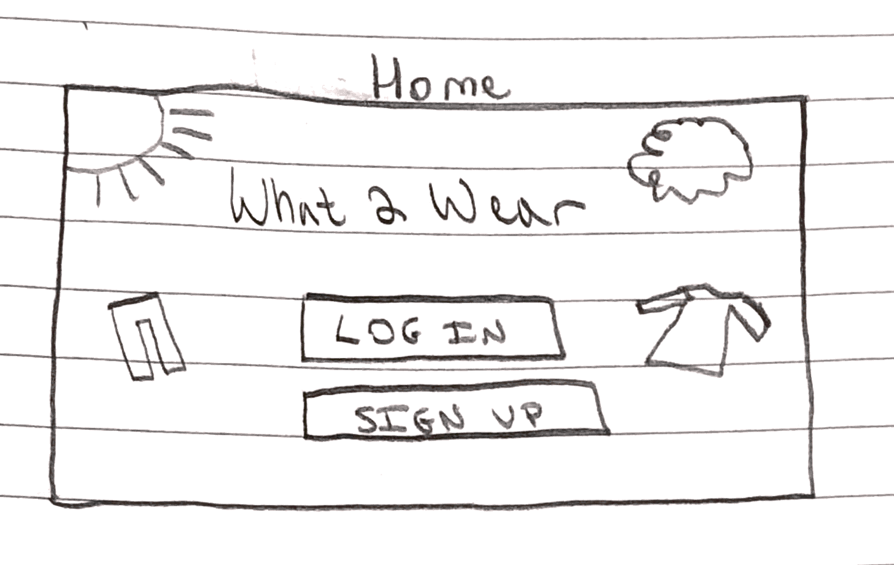
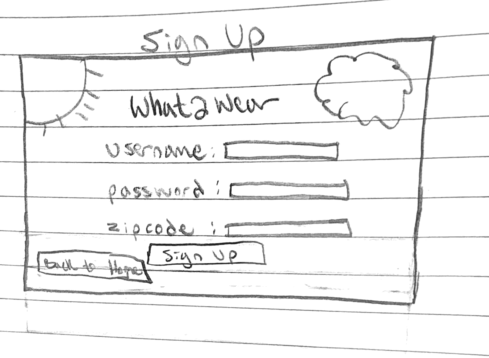
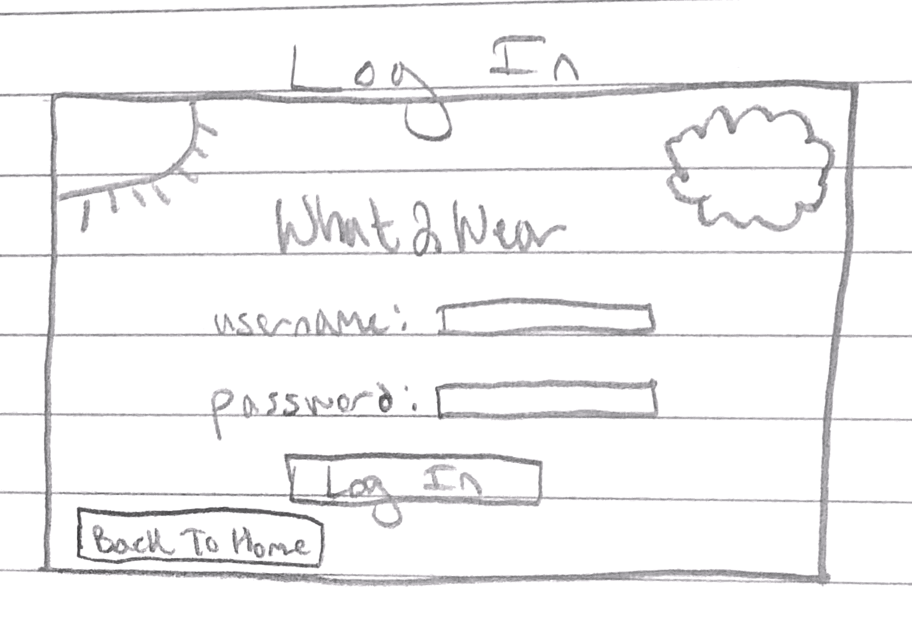
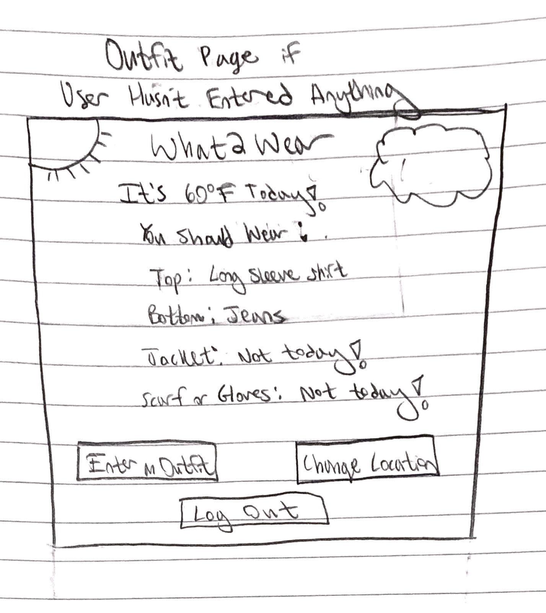
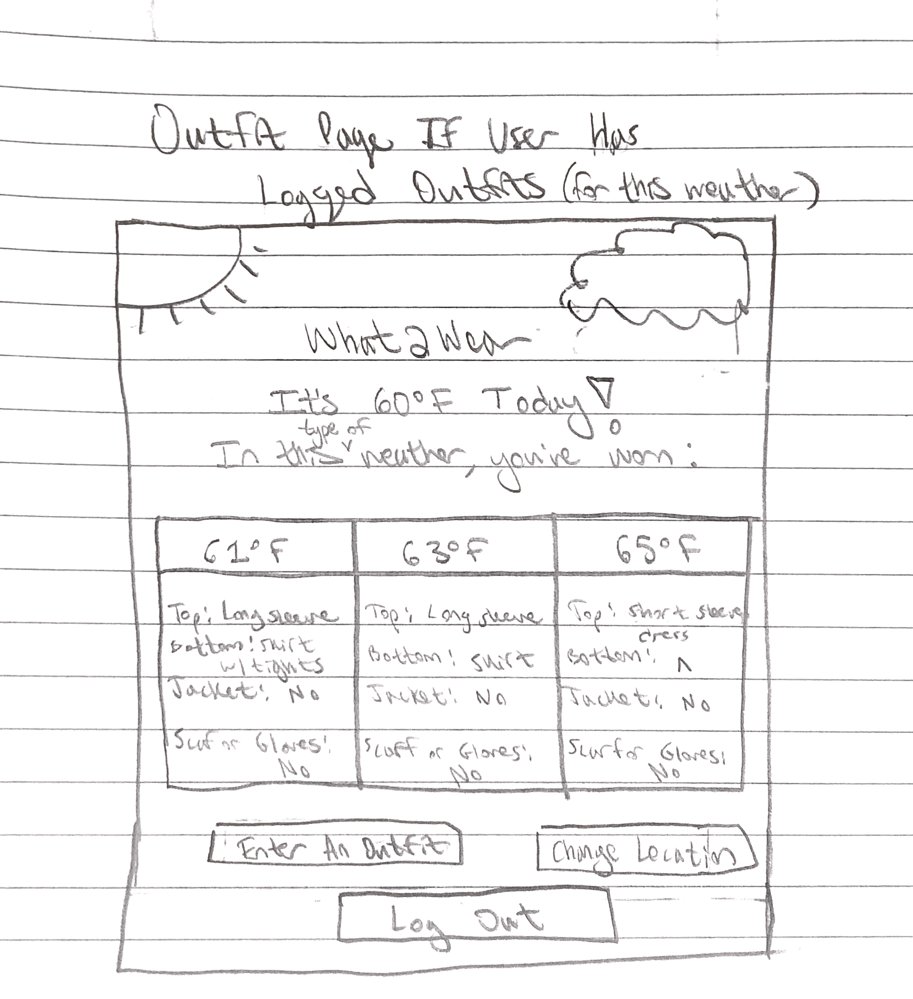
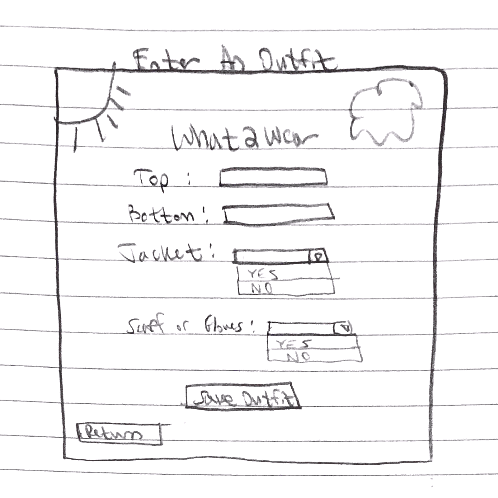
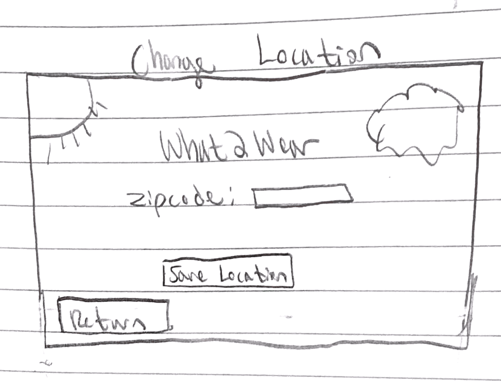
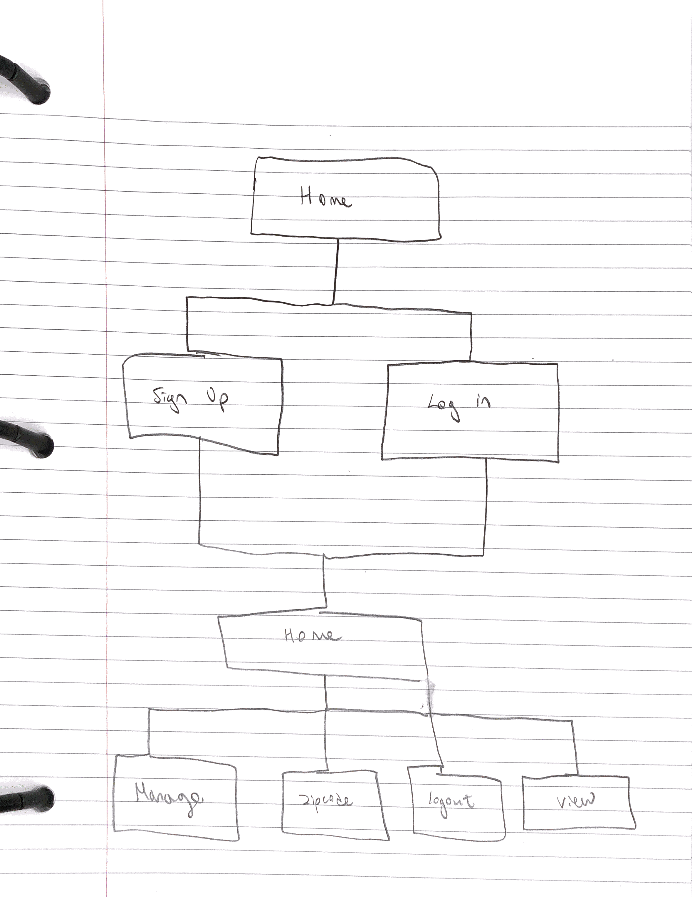

# What2Wear 

## Overview

Ever find yourself opening the weather app, seeing "60 degrees and windy" and thinking, "Okay, but what the heck do I wear?" What2Wear is for you! 

What2Wear is a web app that will allow users to record what they have worn in the past for certain temperatures. Users can register and login. Once they're logged in, they will be told the current weather and what they wore when it was this weather in the past. If the user hasn't logged anything for that temperature range, they will be provided with the option to log what they actually end up wearing that day for future purposes, or to change their location.

## How to Run

Click on this link: https://frozen-scrubland-92156.herokuapp.com


## Data Model

The application will store Users and Outfits

* users can have multiple outfits (via references)
* each outfit has a reference to the user, outfit data, and weather information


An Example User:

```javascript
{
  username: "gdwek",
  password: // a password string,
  outfits: // an array of references to Outfit documents
  zipcode: "10002"
}
```

An Example Outfit:

```javascript
{
  user: // a reference to a User object
  top: "t shirt",
  bottom: "skirt with tights"
  jacket: true
  scarf_gloves: false
  temp: 57
}
```


## [Link to Commented First Draft Schema](db.js) 


## Wireframes

/home - home page



/signup - page to signup



/login - page to log in



/home - home page after user logs in but before user entered an outfit for that weather



/home - home page after lign when user has logged outfits for that weather



/outfit/manage - page to log an outfit and delete an outfit. (wireframe does not match final product exactly but professor said that is okay)



/outfit/zipcode - page to update location




## Site map

'outfit' should be home again



## User Stories or Use Cases

1. as non-registered user, I can register a new account with the site and record my location
2. as a user, I can log in to the site
3. as a user, I can record outfits associated with the weather
4. as a user, I can view all outfits I've worn for the associated range of weather
5. as a user, I can update my location 
6. as a user, I can delete outfits I have logged

## Research Topics

* (2 point) Accuweather Locations API
    * I'm going to be using this to get a location key for another Accuweather API
    * This will allow me to provide the correctly formatted info for next step in process
    * see references #1
* (1 point) Accuweather Current Conditions API
    * I'm going to be using the location key from the Locations API to get the temperature from this API
    * This will allow me to provide the accurate weather for the user's location
    * see references #2
* (3 points) Unit Testing with Mocha
    * will make unit tests for each page
    * this will allow me to make sure my application is working as I go
    * see references #3

6 points total out of 8 required points 


## [Link to Initial Main Project File](app.js) 

## Annotations / References Used

1. [locations API](https://developer.accuweather.com/accuweather-locations-api/apis/get/locations/v1/postalcodes/search) - API documentation
2. [current conditions API](https://developer.accuweather.com/accuweather-current-conditions-api/apis/get/currentconditions/v1/%7BlocationKey%7D) - API documentation
3. [mocha unit testing ](https://github.com/mochajs/mocha) - github repo for mocha unit testing

